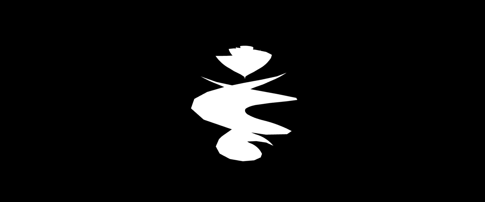
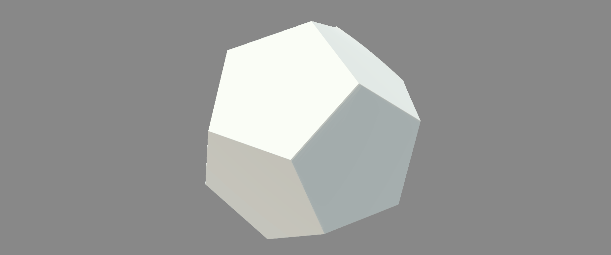

<p align="center">
  
</p>
<p>
  
  <a href="#" target="_blank">
    
  </a>
  <a href="https://twitter.com/alphardex007" target="_blank">
    
  </a>
</p>

# kokomi.js

> A growing three.js helper library.

## Install

```sh
npm i kokomi.js
```

## Hello world

With just several lines, you can make a most basic 3D scene :d

index.html

```html
<div id="sketch" class="bg-black w-screen h-screen overflow-hidden"></div>
```

script.ts

```ts
import * as kokomi from "kokomi.js";

class Sketch extends kokomi.Base {
  create() {
    new kokomi.OrbitControls(this);

    const box = new kokomi.Box(this);
    box.addExisting();

    this.update((time: number) => {
      box.spin(time);
    });
  }
}

const createSketch = () => {
  const sketch = new Sketch();
  sketch.create();
  return sketch;
};

createSketch();
```

Demo (Also can be used as a template): https://codesandbox.io/s/kokomi-js-starter-tjh29w?file=/src/app.ts

## Features

- You can simply extend `kokomi.Base` class to kickstart a simple scene without writing any boilerplate codes.
- Either you can write all your three.js code in a single file, or encapsulate your code into individual classes in a large project. By extending `kokomi.Component`, you can make your components keep their own state and animation.
- `kokomi.AssetManager` can handle the preloads of assets (gltfModel, texture, cubeTexture, font, etc). You can just write a simple json file to config your assets without caring about various loaders.
- Integrated with [three.interactive](https://github.com/markuslerner/THREE.Interactive), which can handle mouse and touch interactions easily.
- Almost every class and function have online demo.

## Previews

### Basic Scene


### Asset Manage


### Util Geometry



### Shadertoy Integration



Credit: https://www.shadertoy.com/view/XtyXzW

## Index

<table>
    <tr>
        <td valign="top">
            <ul>
                <li>
                    <a href="#base">Base</a>
                </li>
                <ul>
                    <li>
                        <a href="#base">Base</a>
                    </li>
                </ul>
            </ul>
            <ul>
                <li>
                    <a href="#camera">Camera</a>
                </li>
                <ul>
                    <li>
                        <a href="#screencamera">ScreenCamera</a>
                    </li>
                </ul>
            </ul>
            <ul>
                <li>
                    <a href="#components">Components</a>
                </li>
                <ul>
                    <li>
                        <a href="#assetmanager">AssetManager</a>
                    </li>
                    <li>
                        <a href="#component">Component</a>
                    </li>
                    <li>
                        <a href="#physics">Physics</a>
                    </li>
                    <li>
                        <a href="#stats">Stats</a>
                    </li>
                </ul>
            </ul>
            <ul>
                <li>
                    <a href="#controls">Controls</a>
                </li>
                <ul>
                    <li>
                        <a href="#orbitcontrols">OrbitControls</a>
                    </li>
                </ul>
            </ul>
            <ul>
                <li>
                    <a href="#geometries">Geometries</a>
                </li>
                <ul>
                    <li>
                        <a href="#hyperbolichelicoid">HyperbolicHelicoid</a>
                    </li>
                    <li>
                        <a href="#sphube">Sphube</a>
                    </li>
                </ul>
            </ul>
            <ul>
                <li>
                    <a href="#panorama">Panorama</a>
                </li>
                <ul>
                    <li>
                        <a href="#imagepanorama">Image Panorama</a>
                    </li>
                </ul>
            </ul>
            <ul>
                <li>
                    <a href="#shapes">Shapes</a>
                </li>
                <ul>
                    <li>
                        <a href="#box">Box</a>
                    </li>
                    <li>
                        <a href="#screenquad">ScreenQuad</a>
                    </li>
                </ul>
            </ul>
            <ul>
                <li>
                    <a href="#utils">Utils</a>
                </li>
                <ul>
                    <li>
                        <a href="#dom">DOM</a>
                    </li>
                    <li>
                        <a href="#gl">GL</a>
                    </li>
                    <li>
                        <a href="#misc">Misc</a>
                    </li>
                </ul>
            </ul>
        </td>
    </tr>
</table>

# API

## Base

### Base

By extending this class, you can kickstart a basic three.js scene easily.

```ts
class Sketch extends kokomi.Base {
  create() {
    // Write your own awesome code here...
  }
}
```

Demo: https://codesandbox.io/s/kokomi-js-starter-tjh29w?file=/src/app.ts

## Camera

### ScreenCamera

This camera can make the pixel unit of a WebGL element equals with one of a HTML Element. If combined with [maku.js](https://github.com/alphardex/maku.js), you can easily merge HTML with WebGL!

```ts
class Sketch extends kokomi.Base {
  create() {
    const screenCamera = new kokomi.ScreenCamera(this);
    screenCamera.addExisting();
  }
}
```

Demo: https://codesandbox.io/s/kokomi-js-screen-camera-hpx78s?file=/src/app.ts

## Components

### AssetManager

This class can handle the preloads of assets (gltfModel, texture, cubeTexture, font, etc). You can just write a simple js file to config your assets without caring about various loaders.

```ts
import foxModel from "/models/Fox/glTF/Fox.gltf";

const resourceList: kokomi.ResourceItem[] = [
  {
    name: "foxModel",
    type: "gltfModel",
    path: foxModel,
  },
];

class Sketch extends kokomi.Base {
  assetManager: kokomi.AssetManager;
  constructor(sel = "#sketch") {
    super(sel);

    const assetManager = new kokomi.AssetManager(this, resourceList);
    this.assetManager = assetManager;
  }
  create() {
    this.assetManager.emitter.on("ready", () => {
      const fox = new Fox(this, this.assetManager.items.foxModel);
      fox.addExisting();
      fox.playAction("idle");
    });
  }
}
```

Demo: https://codesandbox.io/s/kokomi-js-asset-manager-13008e?file=/src/app.ts

### Component

By extending this class, you can make your components keep their own state and animation.

```ts
class MyBox extends kokomi.Component {
  box: kokomi.Box;
  // component's own state
  constructor(base: kokomi.Base) {
    super(base);

    const box = new kokomi.Box(base);
    box.addExisting();
    this.box = box;
  }
  // component's own animation
  update(time: number): void {
    this.box.mesh.rotation.y = time / 1000;
  }
}
```

Demo: https://codesandbox.io/s/kokomi-js-component-wi812m?file=/src/app.ts

### Physics

kokomi.js uses [cannon.js](https://github.com/pmndrs/cannon-es) for physics. Just create mesh and body, and add it to base's physics!

```ts
import * as THREE from "three";
import * as kokomi from "kokomi.js";
import * as CANNON from "cannon-es";

class Box extends kokomi.Component {
  mesh: THREE.Mesh;
  body: CANNON.Body;
  constructor(base: kokomi.Base) {
    super(base);

    const geometry = new THREE.BoxGeometry(2, 2, 0.5);
    const material = new THREE.MeshStandardMaterial({
      metalness: 0.3,
      roughness: 0.4,
    });
    const mesh = new THREE.Mesh(geometry, material);
    this.mesh = mesh;

    const shape = new CANNON.Box(new CANNON.Vec3(1, 1, 0.25));
    const body = new CANNON.Body({
      mass: 1,
      shape,
      position: new CANNON.Vec3(0, 1, 0),
    });
    this.body = body;
  }
  addExisting(): void {
    const { base, mesh, body } = this;
    const { scene, physics } = base;

    scene.add(mesh);
    physics.add({ mesh, body });
  }
}
```

Demo: https://codesandbox.io/s/kokomi-js-physics-tffxge?file=/src/app.ts

### Stats

A drop-in fps meter powered by [stats.js](https://github.com/mrdoob/stats.js)

```ts
class Sketch extends kokomi.Base {
  create() {
    new kokomi.Stats(this);
  }
}
```

Demo: https://codesandbox.io/s/kokomi-js-stats-zwhev9?file=/src/app.ts

## Controls

### OrbitControls

A drop-in orbitControls

```ts
class Sketch extends kokomi.Base {
  create() {
    new kokomi.OrbitControls(this);
  }
}
```

Demo: https://codesandbox.io/s/kokomi-js-starter-tjh29w?file=/src/app.ts

## Geometries

### HyperbolicHelicoid

A [HyperbolicHelicoid](https://mathworld.wolfram.com/HyperbolicHelicoid.html) geometry

```ts
class Sketch extends kokomi.Base {
  create() {
    const geometry = new kokomi.HyperbolicHelicoidGeometry(64, 64);
    const material = new THREE.MeshBasicMaterial();
    const mesh = new THREE.Mesh(geometry, material);
    this.scene.add(mesh);
  }
}
```

Demo: https://codesandbox.io/s/kokomi-js-geometry-hyperbolichelicoid-so35fy?file=/src/app.ts

### Sphube

A [Sphube](https://arxiv.org/pdf/1604.02174.pdf) geometry

```ts
class Sketch extends kokomi.Base {
  create() {
    const geometry = new kokomi.SphubeGeometry(64, 64);
    const material = new THREE.MeshBasicMaterial();
    const mesh = new THREE.Mesh(geometry, material);
    this.scene.add(mesh);
  }
}
```

Demo: https://codesandbox.io/s/kokomi-js-geometry-sphube-57x9k6?file=/src/app.ts

## Panorama

### Image Panorama

First you should add `kokomi.Viewer`, which automatically adds proper camera and orbitControls to your scene.

Then load your image asset with `kokomi.AssetManager`, and after this, you can use `kokomi.ImagePanorama` to get the panorama scene.

```ts
import panoramaImage from "./assets/textures/field.jpg?url";

const resourceList: kokomi.ResourceItem[] = [
  {
    name: "panoramaImage",
    type: "texture",
    path: panoramaImage,
  },
];

class Sketch extends kokomi.Base {
  create() {
    const viewer = new kokomi.Viewer(this);

    const assetManager = new kokomi.AssetManager(this, resourceList);
    assetManager.emitter.on("ready", () => {
      const panoramaImage = assetManager.items.panoramaImage;

      const panorama = new kokomi.ImagePanorama(this, panoramaImage);
      panorama.addExisting();
    });
  }
}
```

Demo: https://codesandbox.io/s/kokomi-js-image-panorama-qyxqff?file=/src/app.ts

## Shapes

### Box

A cute box mesh that we can see everywhere

```ts
class Sketch extends kokomi.Base {
  create() {
    const box = new kokomi.Box(this);
    box.addExisting();
  }
}
```

Demo: https://codesandbox.io/s/kokomi-js-starter-tjh29w?file=/src/app.ts

### ScreenQuad

A fullsceen plane with which you can create fullscreen effects such as raymarching.

By default, it has almost all the uniforms that [shadertoy](https://www.shadertoy.com/) has: `iTime`, `iResolution`, `iMouse`, etc

If you just want to run your shadertoy shader locally, you can turn on `shadertoyMode`, which will inject all the shadertoy uniforms into the fragment shader as well as `main()` function for three.js. Thus, you can just copy & paste your shadertoy shader and run!

```ts
class Sketch extends kokomi.Base {
  create() {
    const screenQuad = new kokomi.ScreenQuad(this, {
      shadertoyMode: true,
      fragmentShader: `your fragment shader here`,
      uniforms: {},
    });
    screenQuad.addExisting();
  }
}
```

Demo (Also template): https://codesandbox.io/s/kokomi-js-screenquad-254wl8?file=/src/app.ts

Shadertoy: https://codesandbox.io/s/kokomi-js-shape-screenquad-gkxfxd?file=/src/app.ts

## Utils

### DOM

#### preloadImages

preload all the img element, powered by [imagesloaded](https://github.com/desandro/imagesloaded)

```ts
class Sketch extends kokomi.Base {
  async create() {
    await kokomi.preloadImages();
  }
}
```

Demo: https://codesandbox.io/s/kokomi-js-screen-camera-hpx78s?file=/src/app.ts

### GL

#### makeBuffer

A shortcut function to make a Float32Array buffer

```ts
class Sketch extends kokomi.Base {
  create() {
    const geometry = new THREE.BufferGeometry();
    const buffer = kokomi.makeBuffer(
      50,
      () => THREE.MathUtils.randFloat(-0.5, 0.5) * 4
    );
    geometry.setAttribute("position", new THREE.BufferAttribute(buffer, 3));
    // produced 50 random position triangles
  }
}
```

Demo: https://codesandbox.io/s/kokomi-js-makebuffer-11975d?file=/src/app.ts

#### iterateBuffer

A shortcut function to iterate through a Float32Array buffer

```ts
class Sketch extends kokomi.Base {
  create() {
    const geometry = new THREE.BufferGeometry();
    const count = 20000;
    const buffer = kokomi.makeBuffer(
      count,
      () => THREE.MathUtils.randFloat(-0.5, 0.5) * 10
    );

    kokomi.iterateBuffer(
      buffer,
      count,
      (arr: number[], axis: THREE.Vector3) => {
        arr[axis.y] = Math.sin(arr[axis.x]);
      }
    );
    geometry.setAttribute("position", new THREE.BufferAttribute(buffer, 3));
  }
}
```

Demo: https://codesandbox.io/s/kokomi-js-iteratebuffer-hycutz?file=/src/app.ts

### Misc

#### enableRealisticRender

Give the three.js renderer some default parameters so that it can produce a realistic effect

```ts
class Sketch extends kokomi.Base {
  create() {
    kokomi.enableRealisticRender(this.renderer);
  }
}
```

Demo: https://codesandbox.io/s/kokomi-js-asset-manager-13008e?file=/src/app.ts

# End

## Author

👤 **alphardex**

- Website: https://alphardex.netlify.app
- Twitter: [@alphardex007](https://twitter.com/alphardex007)
- Github: [@alphardex](https://github.com/alphardex)

## Show your support

Give a ⭐️ if this project helped you!

---

_This README was generated with ❤️ by [readme-md-generator](https://github.com/kefranabg/readme-md-generator)_
